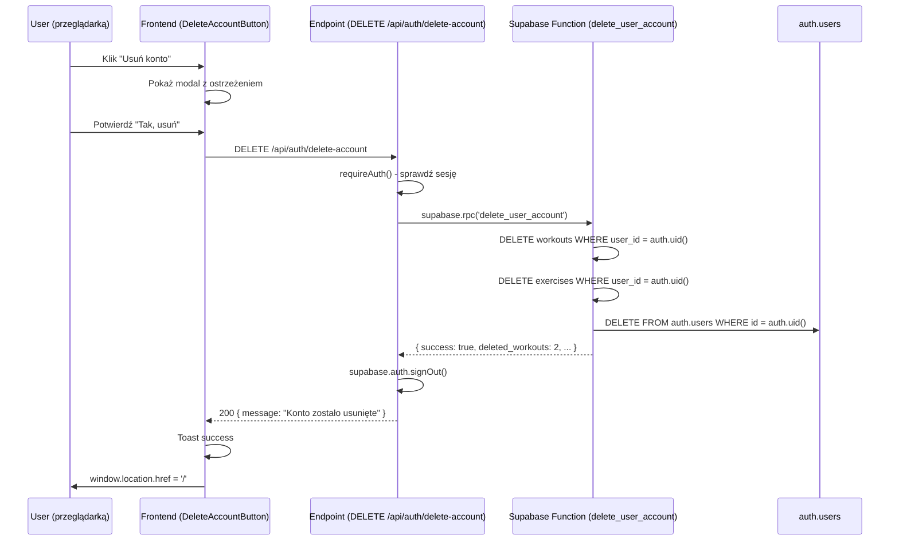

# Setup: Usuwanie konta - Database Function

## ✅ Co zostało zrobione

Zaimplementowano **bezpieczny system usuwania konta** używając Supabase Database Function zamiast admin API.

### Utworzone pliki:

1. **`supabase/migrations/20260130_delete_user_account_function.sql`**
   - SQL function z `SECURITY DEFINER`
   - Kaskadowe usuwanie: workouts → exercises → auth user
   - Zwraca szczegóły operacji

2. **`supabase/README.md`**
   - Instrukcje jak zastosować migracje
   - Troubleshooting

3. **Zaktualizowany `src/pages/api/auth/delete-account.ts`**
   - Używa `supabase.rpc('delete_user_account')` zamiast `admin.deleteUser()`
   - Nie wymaga service_role key

---

## 🚀 Jak to uruchomić (KROK PO KROKU)

### Krok 1: Otwórz Supabase Dashboard

```
https://supabase.com/dashboard
```

Zaloguj się i wybierz swój projekt.

---

### Krok 2: Przejdź do SQL Editor

W menu bocznym kliknij **SQL Editor** (ikona z <>)

---

### Krok 3: Utwórz nową query

Kliknij przycisk **New Query** (prawy górny róg)

---

### Krok 4: Wklej SQL migration

Otwórz plik:

```
supabase/migrations/20260130_delete_user_account_function.sql
```

Skopiuj **całą zawartość** i wklej do SQL Editor w Supabase.

---

### Krok 5: Wykonaj query

Kliknij **Run** (lub naciśnij Ctrl+Enter / Cmd+Enter)

**Oczekiwany rezultat:**

```
Success. No rows returned
```

Jeśli widzisz ten komunikat - **funkcja została utworzona!** ✅

---

### Krok 6: Weryfikacja (opcjonalna)

W SQL Editor wykonaj:

```sql
SELECT routine_name, routine_type, security_type
FROM information_schema.routines
WHERE routine_schema = 'public'
AND routine_name = 'delete_user_account';
```

**Oczekiwany output:**

```
routine_name: delete_user_account
routine_type: FUNCTION
security_type: DEFINER
```

Jeśli `security_type` to `DEFINER` - wszystko działa poprawnie! 🎉

---

## 🧪 Testowanie funkcji

### Test 1: Sprawdź czy przycisk działa

1. W aplikacji (http://localhost:3001) zaloguj się
2. Wejdź na `/app/profile`
3. W sekcji "Strefa niebezpieczna" kliknij **"Usuń konto"**
4. **WAŻNE:** Kliknij "Anuluj" (nie usuwaj jeszcze konta!)

**Oczekiwane:**

- ✅ Modal się otwiera
- ✅ Widoczne ostrzeżenie
- ✅ Przyciski "Anuluj" i "Tak, usuń moje konto"

---

### Test 2: Sprawdź endpoint w konsoli przeglądarki

**Otwórz DevTools (F12) → Console**

Wykonaj (będąc zalogowanym):

```javascript
fetch("/api/auth/delete-account", {
  method: "DELETE",
})
  .then((r) => r.json())
  .then(console.log);
```

**NIE WYKONUJ TEGO!** To usunie twoje konto.

Alternatywnie, sprawdź w **Network tab** co się dzieje po kliknięciu "Usuń konto".

---

### Test 3: Pełny test usuwania (DESTRUKTYWNY)

⚠️ **UWAGA:** Ten test usunie konto! Użyj testowego użytkownika.

1. Utwórz nowe testowe konto: `delete-test@example.com`
2. Zaloguj się na to konto
3. Opcjonalnie: dodaj jakieś treningi (aby sprawdzić kaskadowe usuwanie)
4. Wejdź na `/app/profile`
5. Kliknij "Usuń konto" → "Tak, usuń moje konto"

**Oczekiwane:**

- ✅ Toast: "Konto zostało usunięte"
- ✅ Automatyczne wylogowanie
- ✅ Przekierowanie na `/` (landing page)
- ✅ Próba zalogowania na to samo konto → błąd "Nieprawidłowy email lub hasło"

**W konsoli serwera** (terminal gdzie działa `npm run dev`) zobaczysz:

```
[DeleteAccount] Success: {
  success: true,
  user_id: "...",
  deleted_workouts: 2,
  deleted_exercises: 1,
  message: "User account deleted successfully"
}
```

---

## 🔍 Troubleshooting

### Problem: "function delete_user_account() does not exist"

**Przyczyna:** Migracja nie została zastosowana w Supabase.

**Rozwiązanie:**

1. Sprawdź czy jesteś w odpowiednim projekcie w Supabase Dashboard
2. Wykonaj ponownie Krok 2-5 z sekcji "Jak to uruchomić"
3. Sprawdź czy w SQL Editor nie ma błędów składni

---

### Problem: "permission denied for schema auth"

**Przyczyna:** Funkcja nie ma atrybutu `SECURITY DEFINER`.

**Rozwiązanie:**

1. Sprawdź czy migration zawiera `SECURITY DEFINER` (linia 19)
2. Usuń funkcję i utwórz ponownie:
   ```sql
   DROP FUNCTION IF EXISTS delete_user_account();
   ```
3. Wykonaj ponownie całą migrację

---

### Problem: "Not authenticated" w response

**Przyczyna:** Sesja użytkownika wygasła lub nie istnieje.

**Rozwiązanie:**

1. Wyloguj się
2. Zaloguj się ponownie
3. Spróbuj ponownie

---

### Problem: Endpoint zwraca 500 ale nie ma szczegółów

**Debugowanie:**

1. Sprawdź terminal serwera (gdzie działa `npm run dev`)
2. Poszukaj logów `[DeleteAccount]`
3. W Supabase Dashboard → Logs → sprawdź Database logs

---

## 📊 Co dzieje się "pod maską"



---

## ✅ Checklist

Po wykonaniu setup'u:

- [ ] Migracja została zastosowana w Supabase (Krok 1-5)
- [ ] Funkcja istnieje (weryfikacja w SQL Editor)
- [ ] Modal "Usuń konto" otwiera się poprawnie
- [ ] Przycisk "Anuluj" zamyka modal
- [ ] (Opcjonalnie) Pełny test usuwania na testowym koncie

---

## 🎉 Gotowe!

Po zastosowaniu migracji, funkcja usuwania konta jest **w pełni funkcjonalna** i **bezpieczna**.

Nie wymaga żadnych dodatkowych kluczy API ani konfiguracji po stronie aplikacji.

**Teraz możesz przetestować pełny flow usuwania konta!** 🚀
