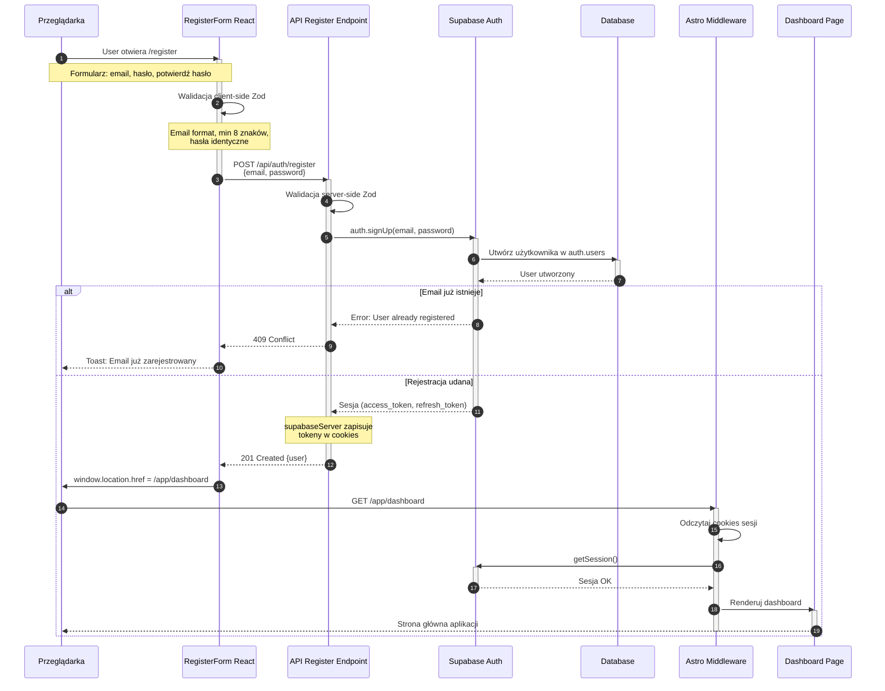
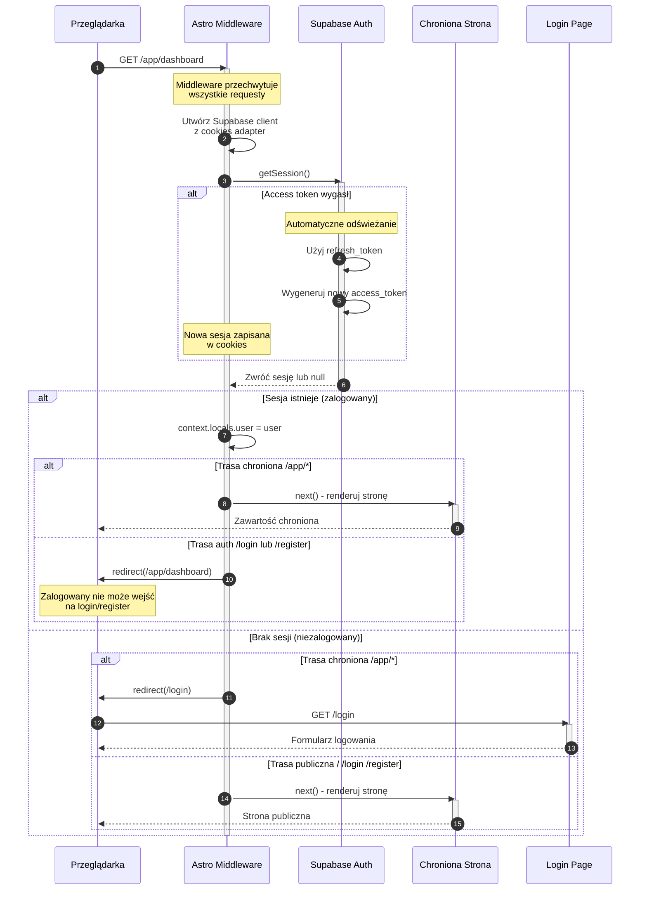

# Diagram Architektury Autentykacji - 10xFitChart MVP

Ten dokument zawiera diagramy sekwencji przedstawiające przepływy autentykacji w aplikacji 10xFitChart, zgodnie z wymaganiami US-001, US-002 i US-003.

## Spis treści

1. [Rejestracja nowego użytkownika (US-001)](#rejestracja-nowego-użytkownika)
2. [Logowanie użytkownika (US-002)](#logowanie-użytkownika)
3. [Ochrona tras przez Middleware](#ochrona-tras-przez-middleware)
4. [Wylogowanie użytkownika](#wylogowanie-użytkownika)
5. [Usuwanie konta (US-003)](#usuwanie-konta-użytkownika)
6. [Odświeżanie tokenu](#odświeżanie-tokenu-sesji)

---

## Rejestracja nowego użytkownika

Przepływ rejestracji nowego użytkownika (US-001) z automatycznym logowaniem.



---

## Logowanie użytkownika

Przepływ logowania istniejącego użytkownika (US-002).

```mermaid
sequenceDiagram
    autonumber
    participant Browser as Przeglądarka
    participant Form as LoginForm React
    participant API as API Login Endpoint
    participant Supabase as Supabase Auth
    participant Middleware as Astro Middleware
    participant Dashboard as Dashboard Page

    Browser->>Form: User otwiera /login
    activate Form
    Note over Browser,Form: Formularz: email, hasło
    
    Form->>Form: Walidacja client-side Zod
    Note over Form: Email format, hasło wymagane
    
    Form->>API: POST /api/auth/login<br/>{email, password}
    deactivate Form
    activate API
    
    API->>API: Walidacja server-side Zod
    
    API->>Supabase: auth.signInWithPassword()
    activate Supabase
    
    Supabase->>Supabase: Weryfikacja credentials bcrypt
    
    alt Nieprawidłowe dane
        Supabase-->>API: Error: Invalid credentials
        deactivate Supabase
        API-->>Form: 401 Unauthorized
        deactivate API
        Form-->>Browser: Toast: Nieprawidłowy email<br/>lub hasło
    else Logowanie udane
        Supabase-->>API: Sesja (access_token, refresh_token)
        deactivate Supabase
        
        Note over API: supabaseServer zapisuje<br/>tokeny w cookies
        
        API-->>Form: 200 OK {user}
        deactivate API
        
        Form->>Browser: Toast: Zalogowano pomyślnie
        Form->>Browser: window.location.href = /app/dashboard
        
        Browser->>Middleware: GET /app/dashboard
        activate Middleware
        
        Middleware->>Middleware: Odczytaj cookies sesji
        Middleware->>Supabase: getSession()
        activate Supabase
        Supabase-->>Middleware: Sesja OK
        deactivate Supabase
        
        Middleware->>Dashboard: Renderuj dashboard
        activate Dashboard
        Dashboard-->>Browser: Strona główna aplikacji
        deactivate Dashboard
        deactivate Middleware
    end
```

---

## Ochrona tras przez Middleware

Przepływ weryfikacji sesji i ochrony chronionych tras `/app/*`.



---

## Wylogowanie użytkownika

Przepływ wylogowania użytkownika i usunięcia sesji.

```mermaid
sequenceDiagram
    autonumber
    participant Browser as Przeglądarka
    participant Button as SignOutButton React
    participant API as API Logout Endpoint
    participant Supabase as Supabase Auth
    participant Landing as Landing Page

    Browser->>Button: User klika Wyloguj się
    activate Button
    
    Button->>Button: setIsLoading(true)
    
    Button->>API: POST /api/auth/logout
    activate API
    
    API->>Supabase: auth.signOut()
    activate Supabase
    
    Supabase->>Supabase: Unieważnij sesję
    Supabase-->>API: OK
    deactivate Supabase
    
    Note over API: supabaseServer usuwa<br/>cookies sesji
    
    alt Wylogowanie udane
        API-->>Button: 200 OK {message}
        deactivate API
        
        Button->>Browser: window.location.href = /
        deactivate Button
        
        Browser->>Landing: GET /
        activate Landing
        Landing-->>Browser: Strona główna landing
        deactivate Landing
        
    else Błąd wylogowania
        API-->>Button: 500 Internal Server Error
        deactivate API
        Button-->>Browser: Toast: Nie udało się wylogować
        Button->>Button: setIsLoading(false)
        deactivate Button
    end
```

---

## Usuwanie konta użytkownika

Przepływ usuwania konta użytkownika (US-003) z kaskadowym usunięciem danych.

```mermaid
sequenceDiagram
    autonumber
    participant Browser as Przeglądarka
    participant Button as DeleteAccountButton React
    participant Modal as AlertDialog Modal
    participant API as API Delete Account
    participant DB as Database
    participant Supabase as Supabase Auth
    participant Landing as Landing Page

    Browser->>Button: User klika Usuń konto
    activate Button
    
    Button->>Modal: Otwórz modal potwierdzenia
    activate Modal
    
    Note over Modal: AlertDialog: Czy na pewno<br/>chcesz usunąć konto?<br/>Ta akcja jest nieodwracalna.
    
    alt User anuluje
        Modal-->>Browser: User klika Anuluj
        Modal->>Modal: Zamknij modal
        deactivate Modal
        deactivate Button
    else User potwierdza usunięcie
        Modal->>Button: User klika Tak usuń konto
        deactivate Modal
        
        Button->>Button: setIsLoading(true)
        
        Button->>API: DELETE /api/auth/delete-account
        activate API
        
        API->>API: Sprawdź autentykację<br/>locals.user
        
        alt Użytkownik niezalogowany
            API-->>Button: 401 Unauthorized
            Button-->>Browser: Toast: Unauthorized
            Button->>Button: setIsLoading(false)
            deactivate Button
        else Użytkownik zalogowany
            Note over API,DB: Kaskadowe usuwanie danych
            
            API->>DB: DELETE FROM workouts<br/>WHERE user_id = ?
            activate DB
            Note over DB: Kaskadowo usuwa workout_sets<br/>przez foreign key
            DB-->>API: Treningi usunięte
            
            API->>DB: DELETE FROM exercises<br/>WHERE user_id = ?
            DB-->>API: Ćwiczenia usunięte
            deactivate DB
            
            API->>Supabase: RPC delete_user_account()<br/>lub admin.deleteUser()
            activate Supabase
            
            Supabase->>DB: DELETE FROM auth.users<br/>WHERE id = ?
            activate DB
            DB-->>Supabase: Użytkownik usunięty
            deactivate DB
            
            Supabase-->>API: OK
            deactivate Supabase
            
            API->>Supabase: auth.signOut()
            activate Supabase
            Note over API: Usuń cookies sesji
            Supabase-->>API: Sesja zakończona
            deactivate Supabase
            
            API-->>Button: 200 OK {message}
            deactivate API
            
            Button->>Browser: Toast: Konto zostało usunięte
            Button->>Browser: window.location.href = /
            deactivate Button
            
            Browser->>Landing: GET /
            activate Landing
            Landing-->>Browser: Strona główna landing
            deactivate Landing
        end
    end
```

---

## Odświeżanie tokenu sesji

Automatyczny proces odświeżania wygasłego access token przez Supabase Auth.

```mermaid
sequenceDiagram
    autonumber
    participant Browser as Przeglądarka
    participant Middleware as Astro Middleware
    participant Supabase as Supabase Auth Client
    participant Auth as Supabase Auth Server
    participant Page as Chroniona Strona

    Browser->>Middleware: GET /app/dashboard
    activate Middleware
    
    Note over Middleware: Request po 1h od logowania<br/>Access token wygasł
    
    Middleware->>Middleware: Utwórz Supabase client<br/>z cookies
    
    Middleware->>Supabase: getSession()
    activate Supabase
    
    Supabase->>Supabase: Sprawdź ważność access_token
    
    Note over Supabase: Access token wygasł!
    
    Supabase->>Supabase: Odczytaj refresh_token<br/>z cookies
    
    alt Refresh token ważny (< 7 dni)
        Supabase->>Auth: Żądanie nowego access_token<br/>z refresh_token
        activate Auth
        
        Auth->>Auth: Weryfikuj refresh_token JWT
        Auth->>Auth: Wygeneruj nowy access_token
        
        Auth-->>Supabase: Nowa sesja<br/>(access_token, refresh_token)
        deactivate Auth
        
        Note over Supabase: Zapisz nowe tokeny<br/>w cookies przez adapter
        
        Supabase-->>Middleware: Sesja odświeżona
        deactivate Supabase
        
        Middleware->>Page: next() - renderuj stronę
        activate Page
        Page-->>Browser: Zawartość chroniona
        deactivate Page
        
    else Refresh token wygasł (> 7 dni)
        Supabase-->>Middleware: null - brak sesji
        deactivate Supabase
        
        Note over Middleware: Użytkownik musi się<br/>zalogować ponownie
        
        Middleware->>Browser: redirect(/login)
        Note over Browser: Przekierowanie na login<br/>z komunikatem o wygaśnięciu sesji
    end
    deactivate Middleware
```

---

## Uwagi implementacyjne

### Bezpieczeństwo

1. **Cookies Configuration**:
   - `sameSite: "lax"` - ochrona przed CSRF
   - `secure: true` (produkcja) - tylko HTTPS
   - `httpOnly: false` - wymagane dla Supabase client-side
   - `maxAge: 7 dni` - czas życia cookies

2. **Row Level Security (RLS)**:
   - Włączone na tabelach: `exercises`, `workouts`, `workout_sets`
   - Polityki filtrują dane po `user_id`
   - Automatyczna weryfikacja JWT w zapytaniach Supabase

3. **Walidacja**:
   - Podwójna walidacja: client-side (React Hook Form + Zod) i server-side (Zod)
   - Minimalna długość hasła: 8 znaków
   - Format email: regex walidacja

### Tokeny

- **Access Token**: 1 godzina (krótki czas dla bezpieczeństwa)
- **Refresh Token**: 7 dni (wygodne dla użytkownika)
- **Odświeżanie**: Automatyczne przez Supabase przy każdym getSession()

### Baza danych

**Usuwanie konta - opcje implementacji**:

1. **Opcja A - Database Function (zalecane)**:
```sql
CREATE OR REPLACE FUNCTION delete_user_account()
RETURNS void
LANGUAGE plpgsql
SECURITY DEFINER
AS $$
BEGIN
  DELETE FROM workouts WHERE user_id = auth.uid();
  DELETE FROM exercises WHERE user_id = auth.uid();
  DELETE FROM auth.users WHERE id = auth.uid();
END;
$$;
```

2. **Opcja B - Admin API**:
```typescript
await supabase.auth.admin.deleteUser(user.id);
```

Opcja A jest bezpieczniejsza (nie wymaga service_role key w aplikacji).

---

## Zależności

- **Astro 5**: SSR framework
- **React 19**: Komponenty UI
- **Supabase Auth**: System autentykacji
- **Zod**: Walidacja schematów
- **React Hook Form**: Zarządzanie formularzami
- **Shadcn/ui**: Komponenty UI (Button, AlertDialog, Toast)
- **Sonner**: Toast notifications

---

## Status implementacji

- ✅ Dokumentacja: PRD (US-001, US-002, US-003)
- ✅ Specyfikacja: auth-spec.md (kompletna)
- ⏳ Implementacja: W toku
- ⏳ Testy: Zaplanowane

---

*Wygenerowano: 2026-01-30*  
*Wersja: MVP 1.0*
